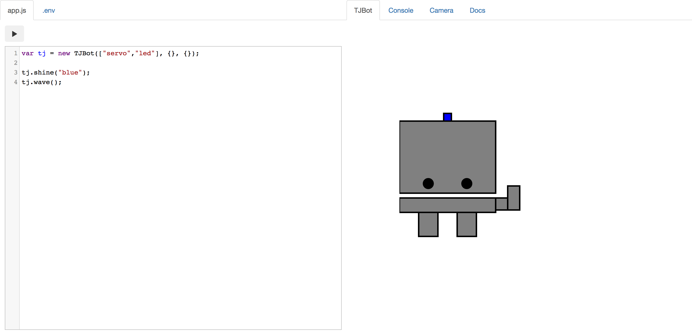

# TJBot Node.js Simulator

This browser-based TJBot simulator can be used to run basic Node.js code to control a virtual TJBot avatar. Use IBM Watson services to listen ([Speech to Text](https://ibm.biz/catalog-speech-to-text)), speak ([Text to Speech](https://ibm.biz/catalog-text-to-speech)), see ([Visual Recogntion](https://ibm.biz/catalog-visual-recognition)), understand natural language ([Conversation](https://ibm.biz/catalog-conversation)), understand tone ([Tone Analyzer](https://ibm.biz/catalog-tone-analyzer)) and translate ([Language Translator](https://ibm.biz/catalog-language-translator)) text.

You can also use [Watson Discovery News](https://ibm.biz/catalog-discovery) service to query news articles.



## How It Works

The code written on the left side of the simulator is run in the browser. Use of the camera, speaker and microphone capabilities may not be available dependent on the browser used and the hardware supported. 

When calling methods that use IBM Watson services, the request is first sent to the Node.js application in the backend which proxies the request to the appropriate Watson service in the cloud. The response is returned back to the simulator. Text to Speech and Speech to Text requests, however, are processed in the browser and sent directly to the Watson service.

Code is only stored locally in the browser. To remove your code, either manually delete the code from the editor, or delete the local storage in the browser settings.

## Getting Started

This simulator can be run locally by cloning and running the Node.js application.

1. Clone the Git repo
    
    ```
    git clone https://github.com/jeancarl/tjbot-simulator
    ```

2. Install the NPM dependencies
    
    ```
    npm install
    ```

3. Run the Node.js application
    
    ```
    npm start
    ```

4. Access the application URL
    
    ```
    http://localhost:<PORT>
    ```


## Deploy to IBM Cloud

This simulator can also be run in a Cloud Foundry application on IBM Cloud.

[](https://bluemix.net/deploy?repository=https://github.com/jeancarl/tjbot-simulator)


## Known Issues

- **setInterval, setTimeout, and never-ending code cannot be terminated**

    Native setInterval and setTimeout functions cannot be terminated in the simulator. It is up to the developer to track usage and clean up interval timers or timeouts before ending the program. Refreshing the page is a current workaround.
    
## License

This code is licensed under Apache 2.0. Full license text is available in [LICENSE](LICENSE). This project uses jQuery and CodeMirror, which have their own respective licenses.
    